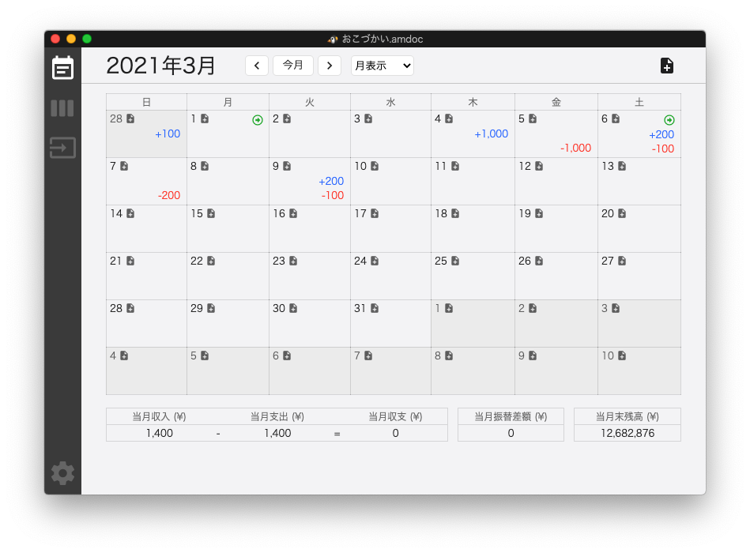
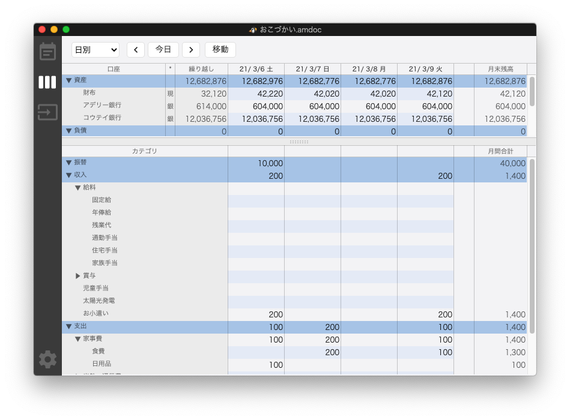
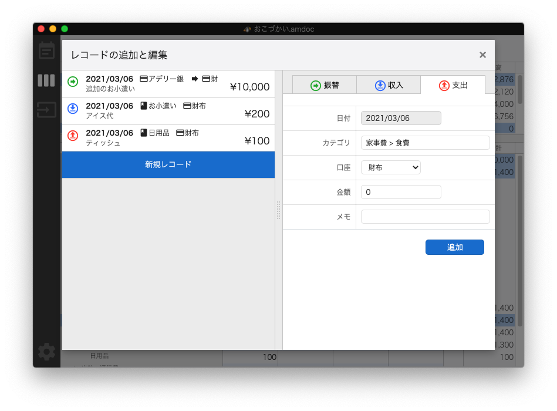

# AdelMoney - macOS 家計簿アプリケーション


AdelMoney は macOS で動くオーソドックスなスタンドアローン家計簿アプリケーションです。

- カレンダーやシートといった基本的なビューでデータを確認・編集できます。
- 支出・収入・振替の３つの分類でレコードを作成・編集できます。
- レコードが所属する口座やカテゴリは制限無く作ることができます。カテゴリは階層化することも可能です。
- 複数口座をひとまとめにした集計用口座も作成できます。
- Palm 書式の CSV ファイルからデータをインポートできます。
- 編集結果はその都度オートセーブされます。
- 他社製品アプリケーション Master Money for Mac 2 からデータを移行することができます。（※移行できるデータには制限があります）





## 動作環境

アプリケーション制作者は以下の OS で動作確認しています。それ以外のバージョンの OS でも動作する可能性はあります。

- macOS 10.15.7（Intel CPU）

## ダウンロード＆実行方法

画面右側の Release のところから最新の dmg ファイルをダウンロードして使用してください。

※本アプリケーションは配布時に必要な署名の手続きをとっていないためアプリケーション起動時に OS の警告が出ます。ご了承ください。

## 権利・ライセンス

本アプリケーションの利用に制限はありません。個人利用・商用利用共に利用料なしで使用いただいて問題ありません。ただし、本アプリケーションは個人制作のアプリケーションであり多数の不具合を抱えている可能性があります。その点をご了承いただいた上でご利用ください。

本アプリケーションを使用して何かトラブルがあった場合、制作者は責任を負いません。

本アプリケーションは本サイト以外での二次配布は禁止します。

本アプリケーションのコードのダウンロード・ビルド、および個人的な改変について制限はありません。ただし、本アプリケーションのコードおよび改変したコード、およびそれらをビルドしたものを第三者への配布することを無断で行わなうことを禁止します。ご希望の方は制作者に連絡して許可を得るようにしてください。

以上は 2021 年 3 月 1 日現在のものです。将来的に予告なく変更されることがあります。

## 開発用情報

**ビルド＆実行の方法**

```
yarn
yarn build
yarn start
```

※yarn のコマンド群は package.json の中を参照して下さい。

**自動ビルドの方法**

コンソールを２つ立ち上げ、それぞれのコンソールで以下のコマンドを実行。

```
# コンソール1
yarn watch

# コンソール2
yarn warch-css

```
