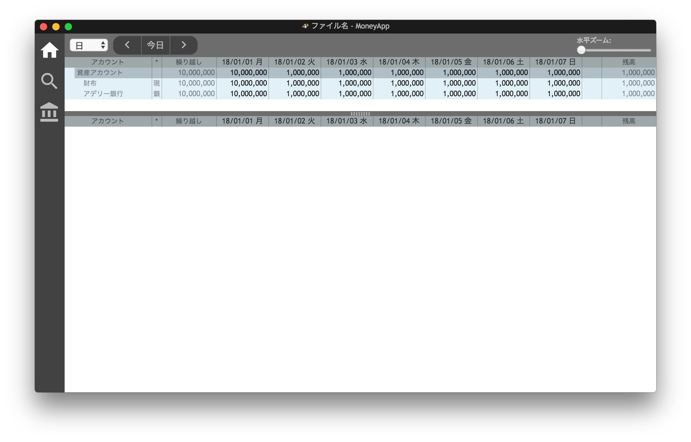
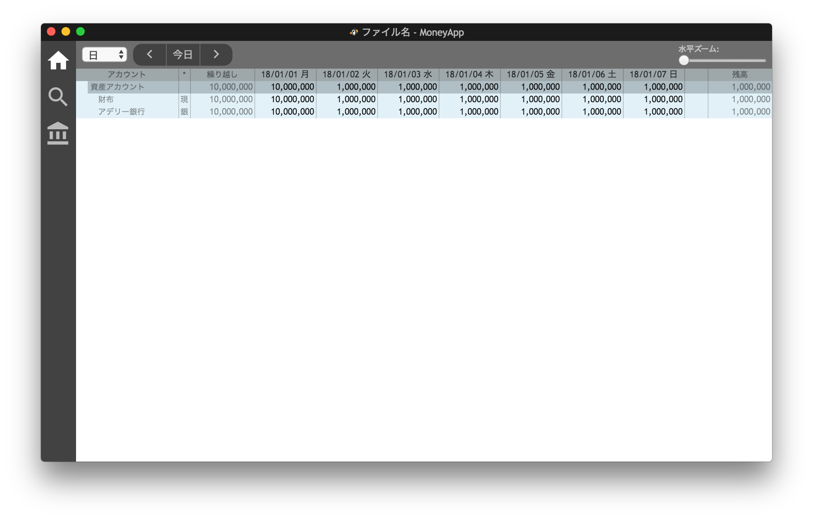
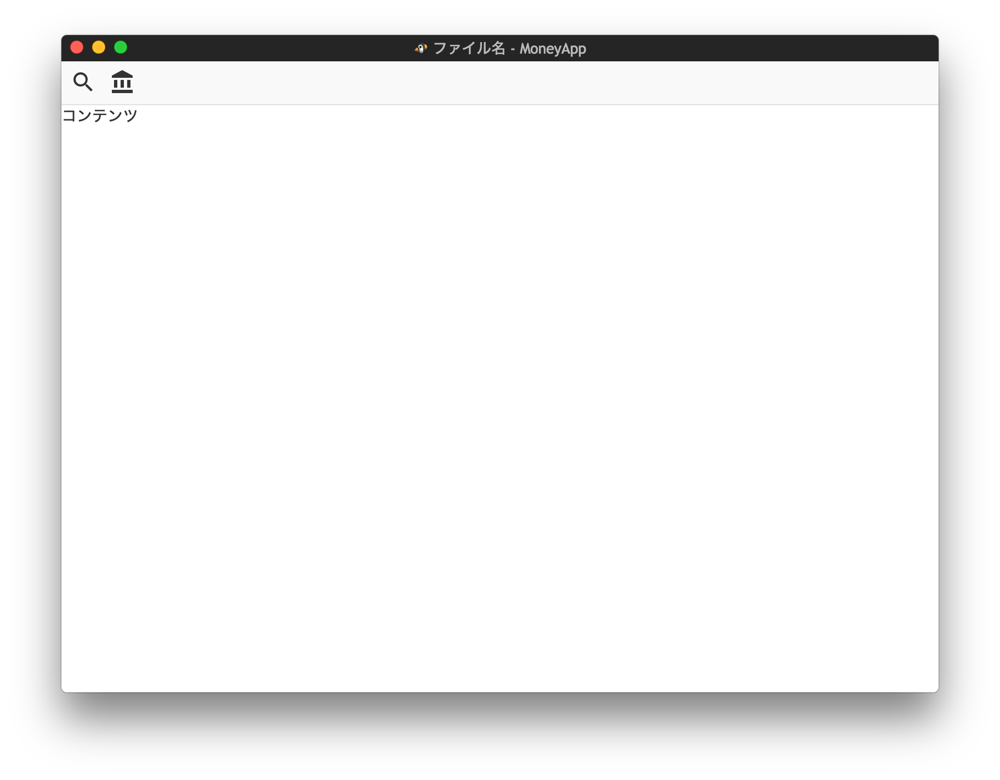

# 開発記録

## 2020-01-26 TypeScript + WebPack + WebWorker 環境のセットアップ

中々情報が出てこない。このページにある情報でいけるのかな？

https://webpack.js.org/loaders/worker-loader/

## 2020-01-26 重い処理を並列実行させる方法

ファイルの自動保存。大きなファイルになると JSON 作成部分だけでも1秒ぐらいかかってもおかしくなさそう。
ということでドキュメントのバックグラウンド保存をやりたくて色々調べました。
Promise を使った方法はあくまで非同期処理であって，重い処理を実行すると Web GUI は固まってしまいます。なので不正解。
WebWorker という仕組みを使うと良さそう。

https://access-jp.co.jp/blogs/development/404

## 2019-07-31 自前でで @types のファイルを用意する手順

bootstrap-datepicker を使おうとして，何を勘違いしたのか @types モジュールが npm で取得できないと思い込み一度自前で用意してしまいました。
まぁでも勉強になったのでメモとしてここに方法残しておきます。

1. @types/bootstrap-datepicker/index.ts を用意

中身はこんな感じ。js-contextmenu を参考にしました。

```ts
// Type definitions for boostracp-datepicker 1.9.0
// Project: https://github.com/uxsolutions/bootstrap-datepicker
// Definitions by: hoboaki
// Definitions: ???
// TypeScript Version: 2.3

/// <reference types="jquery" />

// interface JQueryStatic {
//   contextMenu(options?: JQueryContextMenuOptions): JQuery;
//   contextMenu(type: string, selector?: any): JQuery;
// }

interface JQuery {
  datepicker(options?: any): JQuery;
}
```

2. 使いたいところでこのファイルを import

以上…！わりと簡単でした。
この前諦めた mdb も世の中になければ手動で @types 作ってみようかな。

## 2019-07-24 vscode Mac 環境で単語左右カーソル移動しつつ選択ができない

既定設定で cursorColumnSelectLeft cursorColumnSelectRight が同じキーバインドになっていたのが原因。既定設定で衝突してるってかなり致命的では…？ということでこのキーバインドを消しました。


## 2019-07-23 関数オーバーロードができない

TypeScript で関数オーバーロードできるって書いてあるのにできなくてはまる。これはできないってことでいいのかな…？

https://codeday.me/jp/qa/20181213/35589.html

## 2019-07-21 html element の id は 数字始まりがNG

UUID を使って id をつけていたら
``Error: DOMException: Failed to execute 'querySelectorAll' on 'Document': '#427a4e49-cc5f-4a45-96ed-090a4d6053b4' is not a valid selector.``
といったエラーが時々出るようになりました。

id は数字始まりダメなんでしたそうでした。ということで prefix つけるようにしました。

## 2019-07-20 ローカル関数の宣言方法

こんな感じでできました。っが，こういう再帰パターンでも TypeScript ではいちいち宣言と定義を分けなくていいらしいです。らくちーん！

```ts
let funcParentPath: (categoryId: number) => string;
funcParentPath = (categoryId) => {
  const cat = this.props.outgoCategories[categoryId];
  if (cat.parent == null) {
    return cat.name;
  }
  return `${funcParentPath(cat.parent)} > ${cat.name}`;
};
```


## 2019-07-15 命名ルールの参考情報

そういえば命名ルールどこにも定義してなかったなぁというのに今さら気づきまして。
大文字小文字・キャメルパスカルなどは基本こちらの記事のルールをベースにすることにしました。

https://qiita.com/kabosusoba/items/e811bd1c344aa7b22904

## 2019-07-15 フォルダ名やファイル名を複数系にするか否か

なんでみんな s つけたがるの？というところが気になってたので自分なりに解釈してルールを明確にしました。

- export を複数するファイルは複数系。
- フォルダは原則単数形。

おそらく前者は世の中的にもそうなっているはず！フォルダはたぶんマイノリティルール。

付随するルールで

- export default があるファイルは他に export 書かない。

を自分に課しました。

## 2019-07-15 TypeScript import 挙動のおさらい

import * as 〜 ってどういう意味だっけ？をおさらいしたくて調べました。

http://osamtimizer.hatenablog.com/entry/2018/06/27/222155

## 2019-07-14 配列の配列

以前，書き方分からないと言っていた奴はとても素直な方法で書けることが分かりました。

```ts
const cellDataArray: IData[][] = [
  [
    {...} // IData のインスタンス
  ],
];
```

## 2019-07-11 TypeScript から MDB Dialog をなんとかして操作

開くのは Function で。

```ts
// MDB が TypeScript 非対応なので文字列で実行
new Function(`$('#${this.elementIdRoot}').modal('show')`)();
```

閉じた瞬間のコールバックは MutationObserver でしのぎました。

```ts
this.closeObserver = new MutationObserver((mutations) => {
  mutations.forEach((mutation) => {
    if (mutation.attributeName === 'aria-modal' && mutation.oldValue === 'true') {
      this.props.onClosed();
    }
  });
});
```

## 2019-07-09 カテゴリ選択どうするか

レコード入力のカテゴリ選択をどうするか。
最初ドロップダウン（select）で考えていたのですが、ぴったりなライブラリが見つからず。
最終的に jquery-contextmenu で選ばせるのが理想に近いのでそうしてみることに。

https://swisnl.github.io/jQuery-contextMenu/


日付ピッカーもこういうのもあるみたい。テキスト入力に対応させるならこっちに乗換だけど需要出るまで保留。

http://js.studio-kingdom.com/jqueryui/widgets/datepicker


## 2019-07-08 onClicked に記述する方法で this にアクセスできなくなる

小一時間はまった。一緒に見えるじゃん！

```ts
// これだと onJumpBtnPushed 内の this は undefined
onClick={this.onJumpBtnPushed}

// これだと this にアクセス可
onClick={() => {this.onJumpBtnPushed(); }}
```

## 2019-07-08 js ライブラリで引数に id を渡す奴の対処方法

React なので id を適当につけると重複するのが恐い。
lodash の uniqueId を使って重複を防ぐことにしました。

https://lodash.com/docs#uniqueId

## 2019-07-06 node_modules 以下の css をスコープ処理せずそのまま読み込みたい

webpack.config.js の css 処理周りをこのように変更したらいけた。

```js
{
    // node_modules 以下の css は元のクラス名でロード
    test: /node_modules\/.*\.css$/,
    loaders: ['style-loader', 'css-loader'],
},
{
    // src 以下の css は名前衝突回避されたクラス名でロード
    test: /src\/.*\.css$/,
    loaders: ['style-loader', 'css-loader?modules'],
},
```

loader ってそもそもなんですの？みたいな疑問はこちらのページで解決しました。

https://qiita.com/terrierscript/items/0574ab1ef358fecb55b9

## 2019-07-05 DatePicker 探訪

bootstrap-material-datetimepicker を使おうとしたが TypeScript バインドを手動で書かないといけなくて断念。
別のを探そう。

## 2019-06-25 map 入れ子のキレイな書き方が分からない

これでしのいだけどもっとスマートな書き方ありそう…。

```ts
    interface IData {
      day: number;
      dark: boolean;
    }
    const row0: IData[] = [
      {day: 26, dark: true},
      {day: 27, dark: true},
      {day: 28, dark: true},
      {day: 29, dark: true},
      {day: 30, dark: true},
      {day: 31, dark: true},
      {day: 1, dark: false},
    ];
    const row1: IData[] = [
      {day: 2, dark: false},
      {day: 3, dark: false},
      {day: 4, dark: false},
      {day: 5, dark: false},
      {day: 6, dark: false},
      {day: 7, dark: false},
      {day: 8, dark: false},
    ];
    const row2: IData[] = [
      {day: 9, dark: false},
      {day: 10, dark: false},
      {day: 11, dark: false},
      {day: 12, dark: false},
      {day: 13, dark: false},
      {day: 14, dark: false},
      {day: 15, dark: false},
    ];
    const row3: IData[] = [
      {day: 16, dark: false},
      {day: 17, dark: false},
      {day: 18, dark: false},
      {day: 19, dark: false},
      {day: 20, dark: false},
      {day: 21, dark: false},
      {day: 22, dark: false},
    ];
    const row4: IData[] = [
      {day: 23, dark: false},
      {day: 24, dark: false},
      {day: 25, dark: false},
      {day: 26, dark: false},
      {day: 27, dark: false},
      {day: 28, dark: false},
      {day: 29, dark: false},
    ];
    const row5: IData[] = [
      {day: 30, dark: false},
      {day: 1, dark: true},
      {day: 2, dark: true},
      {day: 3, dark: true},
      {day: 4, dark: true},
      {day: 5, dark: true},
      {day: 6, dark: true},
    ];
    const cellDataArray = [row0, row1, row2, row3, row4, row5];
    const cells = <tbody>
      {cellDataArray.map((row, rowIndex) => {
        return (
          <tr key={rowIndex}>
            {row.map((cell, colIndex) => {
              const classNames = cell.dark ? tableDataDarkClass : tableDataClass;
              return (<td key={rowIndex * 10 + colIndex} className={classNames}>{cell.day}</td>);
            })}
          </tr>
          );
        },
      )}
      </tbody>;
```

## 2018-08-08 vscode で行末空白の自動削除

lint 先生にめっちゃ怒られたので設定しました。

https://qiita.com/iwata-n@github/items/39dc0e4391277589878b

## 2018-08-08 vscode 上で tslint の結果がみたい

ないわけはないだろうと検索したらやっぱりありました。ありがたやー。

https://hi1280.hatenablog.com/entry/2017/07/23/235031

## 2018-08-08 enum キー文字列を parse して enum 値に変換

value の型が number な enum のキー文字列を渡して enum 値に変換するコード。なかなか検索してもでてこず時間かかりました。

```ts
// enum デシリアライズ
const enumPraseAccountKind = (targetKey: string): AccountKind => {
    for (const key in AccountKind) {
    if (key === targetKey) {
        return (+AccountKind[key]) as AccountKind;
    }
    }
    throw new Error(`Error: Not found key named '${targetKey}'.`);
};
```

## 2018-08-05 render 内で配列を指定する際は key が必要

SideBar の render 内で配列を出力したら下記のエラーが出た。

```Warning: Each child in an array or iterator should have a unique "key" prop.```

こちらのサイトに解説がありました。 https://qiita.com/koba04/items/a4d23245d246c53cd49d

配列の要素（今回だと SideBarBtn）に key={ユニークなキー} を追加することで対処。


## 2018-08-05 TypeScript 内で ipcRenderer 使おうとしたら固まる

target が node になっていたのが原因でした。electron-renderer に変えることで対処。

- https://github.com/electron/electron/issues/8846

## 2018-08-05 setInterval のコールバック関数の this ではまる

setInterval の中で this.setState() しようとしたらうまくいかなかったのはこれが原因。

- http://js.studio-kingdom.com/javascript/window/set_interval

## 2018-08-05 React + TypeScript 構成に乗換開始

(この日より前の記録はこの日に書きました)

静的型付けのために TypeScript に変更する。
ついでにHTML出力も楽したいので React に変更してみる。

- スケルトン作成参考
https://qiita.com/EBIHARA_kenji/items/25e59f7132b96cb886f3
- css の import 対応参考
https://qiita.com/Quramy/items/a5d8967cdbd1b8575130
- App コンポーネントコード参考
https://github.com/azu/react-typescript-startup

watch コマンドも整備。

## 2018-08-04 js でデータモデル作成きつくなってきた

静的型付けが欲しい…！

## 2018-08-03 配列は for in じゃなくて for of

配列に対して for in すると index 値が返ってくるので注意。

## 2018-08-02 データモデル作成開始

js のコンストラクタがトリッキー。

```js
**
 * 口座。
 * @constructor
 */
let Account = function() {
    this.id = 0; ///< Id。
    this.name = ""; ///< 口座名。
    this.kind = AccountKind.Invalid; ///< 種類。
    this.initialAmount = 0.0; ///< 初期金額。プラスが貯蓄。マイナスが負債。
};
let account = new Account();
```

## 2018-08-01 スピリッター

Split.js を使った。



## 2018-07-28 アカウントシート

こんな感じよねーを確認するため HTML 直書きで確認。配色はまだぱっとしない。



## 2018-07-27 ツールバーは今風にサイドバー

MaterialDesign 配色も使いながらレイアウトを変更。
スプレッドシートビューのコントロールバーも作成。


## 2018-07-23 タイトルバーとツールバー

MaterialDesign アイコンを使用。
MainプロセスとRenderプロセスははまりどころ。



## 初期状態

C++,C# をメインに使っている人が趣味の時間を使って家計簿アプリを作っていきます。
HTML,CSS,Javascript は 2000 年初頭レベルの知識しかないです。
